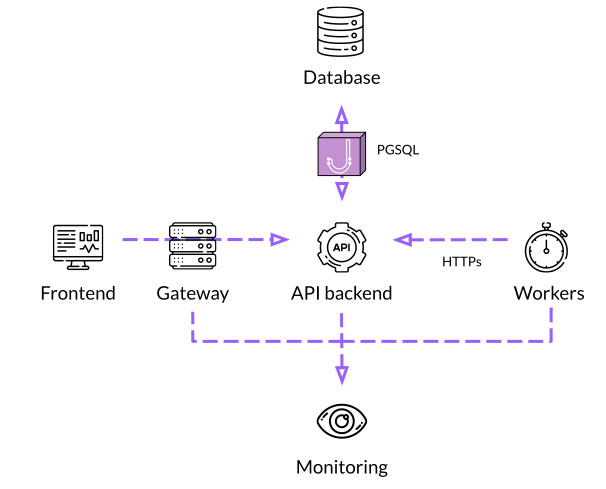

# fintech_devcon 2023

This is the code repository for a workshop given at fintech_devcon 2023 titled "Secure software demistifyed: data security practices"

During the workshop, a microservice application will be refactored to improve security aligned with the [OWASP Top10](https://owasp.org/Top10/) categories for web application security risks. The microservice application contains and NodeJS API, a background worker, and a database. It runs in Kubernetes using Traefik as the network interface.

The workshop is designed to teach security principles as opposed to making specific technology choices. Its goal is to help developers improve the security of their applications by implementing zero trust, updating default framework configurations, adding sensitive data protection, and monitoring events for anomalies.

## Setup

tl;dr
- Install `kubectl`
- Install and configure `k3s` or `k3d` depending on your local operating system
- Or if you have an existing Kubernetes cluster running with administrative rights, you can skip this setup

This application runs as microservices in Kubernetes. To work through the steps locally, we recommend using [Rancher k3s](https://github.com/k3s-io/k3s), a lightweight Kubernetes installation that is "easy to install, half the memory, all in a binary less than 100 MB."

### macOS

If you are using macOS, use [k3d](https://k3d.io/v5.5.2/) to run k3s. "k3d is a lightweight wrapper to run k3s in docker." So you will need docker installed on your local machine.

[INSERT OR LINK TO INSTRUCTIONS FOR INSTALLING DOCKER]

[INSERT INSTRUCTIONS FOR INSTALLING K3D]

### Linux (or WSL2)

If you are using Windows with WSL2, you can install k3s directly. We recommend downloading the k3s binary directly instead of using the setup script provided by Rancher. This will skip the system changes that the script performs to configure a production version of k3s, as it will only be used for development

```
 wget -q "https://github.com/k3s-io/k3s/releases/download/v1.25.11%2Bk3s1/k3s" -O /tmp/k3s
 sudo mv /tmp/k3s /usr/local/bin/k3s
 sudo chmod u+x bin/k3s
 k3s --version
```

You should see the following output:

```
$ k3s --version
k3s version v1.25.11+k3s1 (582f07cf)
go version go1.19.10
```

To run k3s, use the following command:
```
sudo K3S_KUBECONFIG_MODE="644" k3s server
```

After starting the server for the first time, various configuration files will be added to your OS. For example, to use `kubectl` with the k3s cluster, simply export the Rancher configuration file as an environment variable:

```
$ export KUBECONFIG=/etc/rancher/k3s/k3s.yaml
$ kubectl get pods
```
## Workshop exercises

The microservice application in this workshop starts with a multi-tier architecture that is common to many web applications. It includes an API, background jobs and a database.


After making various software and infrastructure changes, the architecture will evolve to include an API gateway, a database gateway, and an observability stack.


